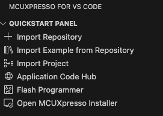
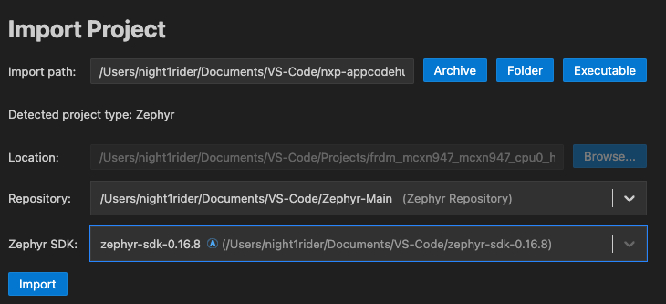

# wolfSSL NXP Application Code Hub

<a href="https://www.nxp.com">  </a> <a href="https://www.wolfssl.com">  </a>

This repo is currently a work in progress, and some items are placeholders.

## How to Use
The projects in this repo are intended to be used with NXP's [MCUXpresso for VS-code plugin](https://www.nxp.com/products/processors-and-microcontrollers/arm-microcontrollers/general-purpose-mcus/lpc800-arm-cortex-m0-plus-/mcuxpresso-for-visual-studio-code:MCUXPRESSO-VSC?cid=wechat_iot_303216).

To use a demo project, simply use the provided `setup.sh` on the given project you want to run.

All projects were initially tested with `Zephyr v4.0.0` and `Zephyr SDK 0.16.8`

### 1. Setup

#### Example
MacOS and Linux:
```
cd /path/to/nxp-appcodehub
./setup.sh dm-wolfssl-tls-hello-server-with-zephyr
```
Expected Output:
```
nxp-appcodehub % ./setup.sh dm-wolfssl-tls-hello-server-with-zephyr 
Created .vscode directory in dm-wolfssl-tls-hello-server-with-zephyr.
cmake-kits.json created.
cmake-variants.json created.
launch.json created.
mcuxpresso-tools.json created.
settings.json created.
```

This creates the necessary base files that the plugin needs to import the project correctly.

The default board is the FRDM-MCXN947. If you want to use a different board, like the `mimxrt1060_evkb`, add a second argument to the command like so:
```
./setup.sh dm-wolfmqtt-button-publisher-client-with-zephyr mimxrt1060_evkb
```

You may need to double-check the `prj.conf` settings of the project to disable and/or enable drivers specific for the board. 

### 2. Import the Project

Assuming you have the necessary software described in the README for the given
project, you simply need to go to the MCUXpresso plugin menu and select `Import Project` as seen in the figure below.

[](Images/Plugin-Menu.png)

Once you select `Import Project`, select the path for the desired project you want to run. This will then detect the type of project. You will need to set up any repositories and SDKs through the plugin options.

In the figure below, the imported project is of the type `Zephyr`, which means it needs to point to the Zephyr SDK and Repository. These can be installed via the `Import Repository` and the `MCUXpresso Installer` options seen in the previous menu.

[](Images/Import-Menu.png)

Once you select the `Repository` and `SDK` you want to use with the imported project, hit the `Import` button.

## Setting Up wolfSSL, wolfMQTT, and wolfSSH

Currently, with the way the projects are set up, you will need to add wolfSSL, wolfSSH, wolfMQTT, etc., to the `west.yml` file inside the Zephyr repo specified during the import of the project.

So for example the following would be added to `/Users/night1rider/Documents/VS-Code/Zephyr-Main/zephyr/west.yml` 
and then a `west update` performed inside that directory to update the repositories available to `Zephyr`.

```
manifest:
  remotes:
    # <your other remotes>
    - name: wolfssl
      url-base: https://github.com/wolfssl
    - name: wolfssh
      url-base: https://github.com/wolfssl
    - name: wolfmqtt
      url-base: https://github.com/wolfssl

  projects:
    # <your other projects>
    - name: wolfssl
      path: modules/crypto/wolfssl
      revision: v5.7.6-stable
      remote: wolfssl
    - name: wolfssh
      path: modules/lib/wolfssh
      revision: v1.4.18-stable
      remote: wolfssh
    - name: wolfmqtt
      path: modules/lib/wolfmqtt
      revision: v1.19.1
      remote: wolfmqtt
```

For more Zephyr-specific examples, look at the following READMEs:
- [wolfSSL](https://github.com/wolfSSL/wolfssl/tree/master/zephyr)
- [wolfSSH](https://github.com/wolfSSL/wolfssh/tree/master/zephyr)
- [wolfMQTT](https://github.com/wolfSSL/wolfmqtt/tree/master/zephyr)


