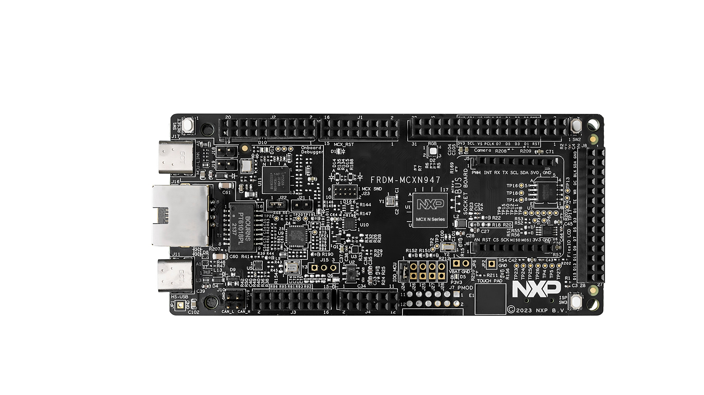
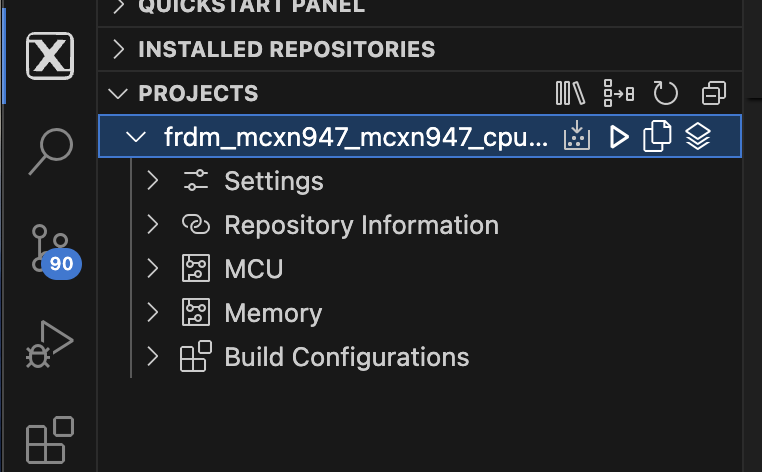

# NXP Application Code Hub

  
  

## wolfSSL TLSv1.3 Hello Server using Zephyr RTOS

This demo demostrate capabilities of new FRDM-MCXN947.  
There has some variants that are divided on branches in [Application Code Hub](https://github.com/nxp-appcodehub)     

### Demo   
Creating a simple server using the Zephyr RTOS and wolfSSL to utilize the networking capabilities of the FRDM-MCXN947 through its ethernet port.  

#### Boards:        FRDM-MCXN947
#### Categories:    RTOS, Zephyr, Networking
#### Peripherals:   UART, ETHERNET
#### Toolchains:    Zephyr

## Table of Contents
1. [Software](#step1)
2. [Hardware](#step2)
3. [Setup](#step3)
4. [Verification](#step4)
5. [Project Options](#step5)
6. [FAQs](#step6) 
7. [Support](#step7)
8. [Release Notes](#step8)

## 1. Software
- [MCUXpresso for VScode 1.5.61 or newer](https://www.nxp.com/products/processors-and-microcontrollers/arm-microcontrollers/general-purpose-mcus/lpc800-arm-cortex-m0-plus-/mcuxpresso-for-visual-studio-code:MCUXPRESSO-VSC?cid=wechat_iot_303216)

- [Zephyr Setup](https://docs.zephyrproject.org/latest/develop/getting_started/index.html)
    - [wolfSSL as a Module added to Zephyr](https://github.com/wolfSSL/wolfssl/blob/master/zephyr/README.md)
    - [Adding the Zephyr Repository (Part 5)](https://community.nxp.com/t5/MCUXpresso-for-VSCode-Knowledge/Training-Walkthrough-of-MCUXpresso-for-VS-Code/ta-p/1634002)

- MCUXpresso Installer:
   - MCUXpresso SDK Developer
   - Zephyr Developer
   - Linkserver

- Ubuntu or MacOS with the following packages:
    - autoconf
    - automake
    - libtool
    - make
    - gcc
    - git 

- Optional Software:
    - Wireshark

## 2. Hardware
- [FRDM-MCXN947.](https://www.nxp.com/products/processors-and-microcontrollers/arm-microcontrollers/general-purpose-mcus/mcx-arm-cortex-m/mcx-n94x-and-n54x-mcus-with-dual-core-arm-cortex-m33-eiq-neutron-npu-and-edgelock-secure-enclave-core-profile:MCX-N94X-N54X)   

- USB Type-C cable.
- Ethernet Cable.
- Networking/Router
- Personal Computer.

## 3. Setup

### 3.1 Import the Project and build
1. Follow section 1: `Setup` in the top level [README](../README.md)
2. Under the "Projects" tab, right click the project and choose "build selected", this should result in no errors. 

The project should be called `dm-wolfssl-tls-hello-server-with-zephyr`.

### 3.2 Connect hardware
1. Connect the FRDM-MCXN947 to you computer with the provided USB-C Cable

2. Connect the FRDM-MCXN947 to your network with a ethernet cable

## 6. FAQs
No FAQs have been identified for this project.

## 7. Support

#### Project Metadata
<!----- Boards ----->

<!----- Categories ----->

<!----- Peripherals ----->
 

<!----- Toolchains ----->

Questions regarding the content/correctness of this example can be entered as Issues within this GitHub repository.

>**Warning**: For more general technical questions regarding NXP Microcontrollers and the difference in expected funcionality, enter your questions on the [NXP Community Forum](https://community.nxp.com/)

## 8. Release Notes
| Version | Description / Update                           | Date                        |
|:-------:|------------------------------------------------|----------------------------:|
| 1.0     | Initial release on Application Code Hub        | TBD|