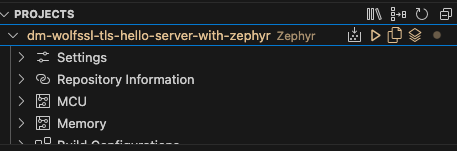
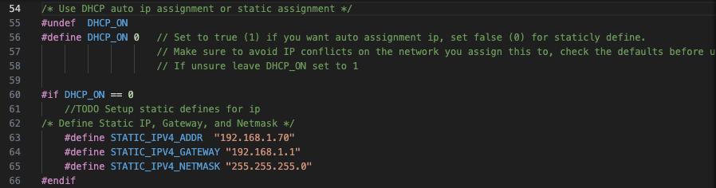
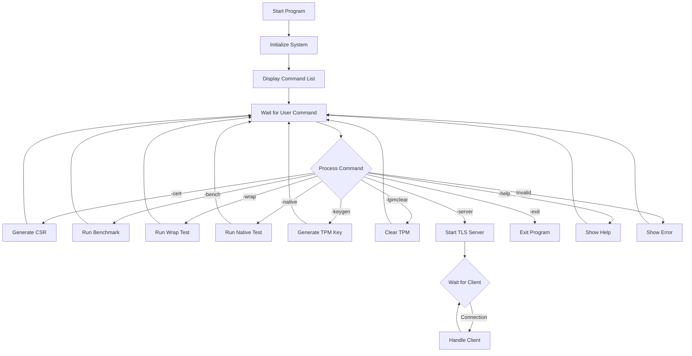

# wolfSSL NXP Application Code Hub

<a href="https://www.nxp.com">  </a> <a href="https://www.wolfssl.com">  </a>

## NOTICE

To use this demo you need the following branches untill wolfSSL and wolfTPM are
updated to support Zephyr for the DEMO:
1. wolfTPM in the `west.yml` needs to be updated to use the following branch:
This only needs to happen if this
(PR)[https://github.com/wolfSSL/wolfTPM/pull/395] is not merged:

    remotes:
        - name: wolftpm
          url-base: https://github.com/aidangarske
    projects:
        - name: wolftpm
          path: modules/lib/wolftpm
          revision: tpm_zephyr_support
          remote: wolftpm


## wolfTPM Interactive Demo with TLS Server using Zephyr RTOS

This demo demonstrates the comprehensive integration of wolfTPM with wolfSSL on the FRDM-MCXN947 platform.

### Demo   
This interactive demo showcases various TPM capabilities using Zephyr RTOS and wolfTPM, as well as a TLSv1.3 server implementation. The application provides an interactive command-line interface to perform TPM operations including key generation, CSR creation, benchmarking, and various TPM tests, along with secure communication capabilities through a TLS server.

#### Boards:        FRDM-MCXN947
#### Categories:    RTOS, Zephyr, Security, TPM, Networking
#### Peripherals:   UART, ETHERNET, TPM, SD Card
#### Toolchains:    Zephyr

## Table of Contents
1. [Software](#step1)
2. [Hardware](#step2)
3. [Setup](#step3)
4. [Project Features](#step4)
5. [Project Options](#step5)
6. [Project Flow Chart](#step6)
7. [FAQs](#step7) 
8. [Support](#step8)
9. [Release Notes](#step9)

## 1. Software<a name="step1"></a>
- [MCUXpresso for VScode 1.5.61 or newer](https://www.nxp.com/products/processors-and-microcontrollers/arm-microcontrollers/general-purpose-mcus/lpc800-arm-cortex-m0-plus-/mcuxpresso-for-visual-studio-code:MCUXPRESSO-VSC?cid=wechat_iot_303216)

- [Zephyr Setup](https://docs.zephyrproject.org/latest/develop/getting_started/index.html)
    - [wolfSSL as a Module added to Zephyr](https://github.com/wolfSSL/wolfssl/blob/master/zephyr/README.md)
    - [wolfTPM as a Module added to Zephyr](https://github.com/wolfSSL/wolfTPM/blob/master/zephyr/README.md)
    - [Adding the Zephyr Repository (Part 5)](https://community.nxp.com/t5/MCUXpresso-for-VSCode-Knowledge/Training-Walkthrough-of-MCUXpresso-for-VS-Code/ta-p/1634002)

- MCUXpresso Installer:
   - MCUXpresso SDK Developer
   - Zephyr Developer
   - Linkserver

- Ubuntu or MacOS with the following packages:
    - autoconf
    - automake
    - libtool
    - make
    - gcc
    - git 

## 2. Hardware<a name="step2"></a>
- [FRDM-MCXN947.](https://www.nxp.com/products/processors-and-microcontrollers/arm-microcontrollers/general-purpose-mcus/mcx-arm-cortex-m/mcx-n94x-and-n54x-mcus-with-dual-core-arm-cortex-m33-eiq-neutron-npu-and-edgelock-secure-enclave-core-profile:MCX-N94X-N54X)   
[](Images/FRDM-MCXN947-TOP.jpg)
- USB Type-C cable
- Ethernet Cable (Required for TLS server functionality)
- SD Card (Required for key generation and CSR operations)
- Personal Computer
- TPM (SLB9673)
- Networking/Router (for TLS server testing)

## 3. Setup<a name="step3"></a>

### 3.1 Import the Project and build
1. Follow section 1: `Setup` in the top level [README](../README.md)
2. Under the "Projects" tab, right click the project and choose "build selected", this should result in no errors. 

[](Images/Setup3-3.png)

The project should be called `dm-wolftpm-wolfssl-tls-with-zephyr`.

### 3.2 Connect hardware
1. Plug in your TPM to the corresponding ports
    ```
    ports:

    ```

2. Insert a FAT32 formatted SD card
3. Connect the FRDM-MCXN947 to your computer with the provided USB-C Cable
4. Connect an Ethernet cable to your network (required for TLS server functionality)

### 3.3 Program and Run the Demo
1. Flash the .elf to FRDM-MCXN947, Can be done with right clicking the project and choosing to "flash the selected target"
2. Connect to the Serial Output of the FRDM-MCXN947 via:
    - Screen Command - `screen /dev/tty"MCXN-Port 115200`
    - Some Serial Terminal you are familiar with 
3. Push reset button on the FRDM-MCXN947 board and view the startup message with available commands.

[](Images/Setup3-4.png)

## 4. Project Features<a name="step4"></a>

### 4.1 Interactive TPM Commands
The demo provides an interactive shell with the following TPM commands:

- `-cert`: Generate a Certificate Signing Request (CSR) using TPM
- `-bench`: Run TPM benchmarks with various options
- `-wrap`: Run TPM key wrapping tests
- `-native`: Run TPM native tests
- `-keygen`: Generate keys using the TPM
- `-tpmclear`: Clear the TPM
- `-exit`: Exit the program
- `-help`: List available commands

### 4.2 TLSv1.3 Server Functionality
The demo also includes a TLSv1.3 server that:
- Securely communicates with clients using the wolfSSL library
- Leverages hardware security through the TPM
- Can be tested using the wolfSSL client application

To connect to the TLS server from a client:
1. Note the IP address displayed on the device
2. Use the wolfSSL client application:
   ```
   ./examples/client/client -h <device_ip> -v 4
   ```

### 4.3 Key Generation
The key generation feature allows you to:
- Generate RSA, ECC, or symmetric keys
- Specify output file on the SD card
- Define template and parameter encryption options

### 4.4 Benchmarking
The benchmark feature allows you to:
- Test AES or XOR operations
- Set custom benchmark durations
- Evaluate TPM performance

### 4.5 Certificate Signing Request (CSR)
Generate a CSR using TPM-protected keys which can be used for certificate enrollment.

## 5. Project Options<a name="step5"></a>
### 5.1 Setting up a static IPv4 on Zephyr
By default the project is setup to use a DHCP Server, this section will show how to setup a static IP. Please make sure you chose an IP for the device that will not cause a IP confilct on your network.

1. In [src/main.c](src/main.c), look for the following section.

    [](Images/ProjectOptions5-1-1.png)

2. Set DHCP off for the project by changing

    `#define DHCP_ON 1` 
    
    to

    `#define DHCP_ON 0`

3. Set the `STATIC_IPV4_ADDR` macro to your desired IP, by default it is set to `192.168.1.70`. Make sure the IP you choose does not cause a conflict on your network.

4. Set the `STATIC_IPV4_GATEWAY` macro to your network's gateway. Usally this is `192.168.1.1` on home networks, however this could not always be the case. This is usally the IP of your primary network router.

5. Set the `STATIC_IPV4_NETMASK` macro to your needs. Generally `255.255.255.0` for most use cases.

6. Rebuild the project and flash the device.

### 5.2 Changing the TLS Version
The project allows configuring the TLS version used by the server:

1. In [src/main.c](src/main.c) locate the TLS version macro:
   ```c
   #define TLS_VERSION 3
   ```

2. Change it to 2 for TLSv1.2 or leave it as 3 for TLSv1.3.

3. When connecting with a client, make sure to specify the matching version:
   ```
   ./examples/client/client -h <device_ip> -v 4  # for TLSv1.3
   ./examples/client/client -h <device_ip> -v 3  # for TLSv1.2
   ```

### 5.3 Changing the Server's Port
If you want to change the port from the default `11111`:

1. In [src/main.c](src/main.c) locate:
   ```c
   #define DEFAULT_PORT 11111
   ```

2. Change it to your desired port number.

3. When connecting with a client, specify the port:
   ```
   ./examples/client/client -h <device_ip> -v 4 -p <port>
   ```

## 6. Project Flowchart<a name="step6"></a>
### Overview



## 7. FAQs<a name="step7"></a>
1. **Q: Why is my SD card not recognized?**
   A: Ensure your SD card is properly formatted (FAT32) and correctly inserted.

2. **Q: What happens if I run -tpmclear?**
   A: This will clear all data in the TPM, including any generated keys.

3. **Q: Can I use the TLS server and TPM features together?**
   A: Yes, the TLS server can leverage TPM capabilities for enhanced security.

4. **Q: Why can't clients connect to my TLS server?**
   A: Check your network settings, firewall rules, and ensure the client is using the correct IP address, port, and TLS version.

## 8. Support<a name="step8"></a>

#### Project Metadata
<!----- Boards ----->
[](https://github.com/search?q=org%3Anxp-appcodehub+FRDM-MCXN947+in%3Areadme&type=Repositories)

<!----- Categories ----->
[](https://github.com/search?q=org%3Anxp-appcodehub+security+in%3Areadme&type=Repositories)
[](https://github.com/search?q=org%3Anxp-appcodehub+rtos+in%3Areadme&type=Repositories)
[](https://github.com/search?q=org%3Anxp-appcodehub+networking+in%3Areadme&type=Repositories)

<!----- Peripherals ----->
[](https://github.com/search?q=org%3Anxp-appcodehub+uart+in%3Areadme&type=Repositories) [](https://github.com/search?q=org%3Anxp-appcodehub+ethernet+in%3Areadme&type=Repositories) [](https://github.com/search?q=org%3Anxp-appcodehub+tpm+in%3Areadme&type=Repositories)

<!----- Toolchains ----->
[](https://github.com/search?q=org%3Anxp-appcodehub+vscode+in%3Areadme&type=Repositories)

Questions regarding the content/correctness of this example can be entered as Issues within this GitHub repository.

>**Warning**: For more general technical questions regarding NXP Microcontrollers and the difference in expected funcionality, enter your questions on the [NXP Community Forum](https://community.nxp.com/)

## 9. Release Notes<a name="step9"></a>
| Version | Description / Update                           | Date                        |
|:-------:|------------------------------------------------|----------------------------:|
| 1.0     | Initial release on Application Code Hub        | TBD|